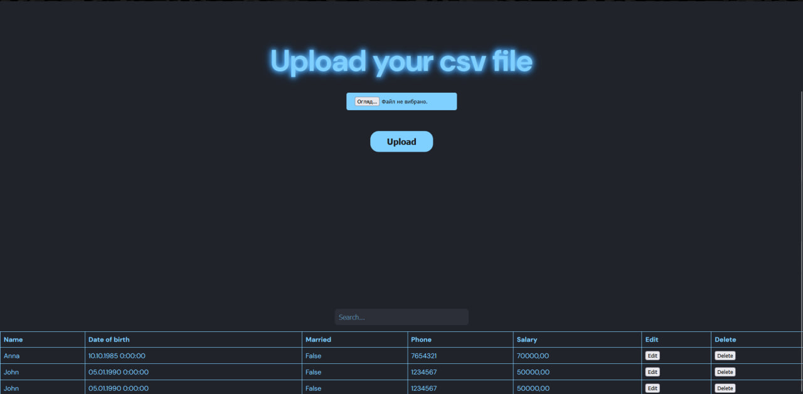
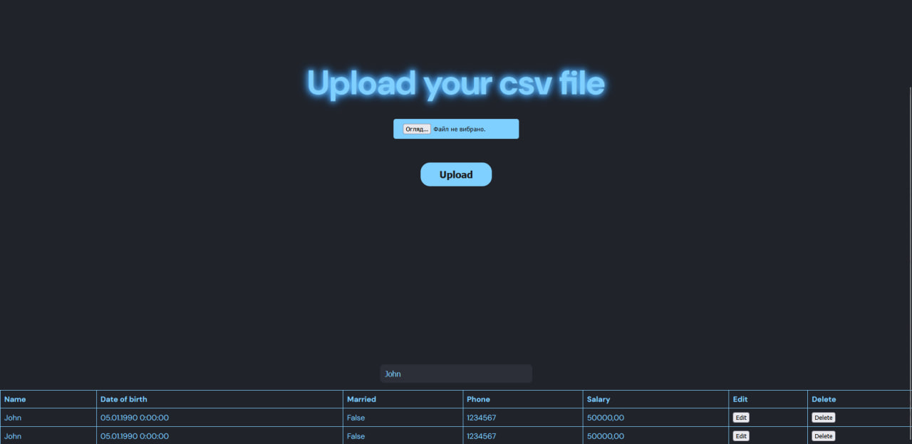
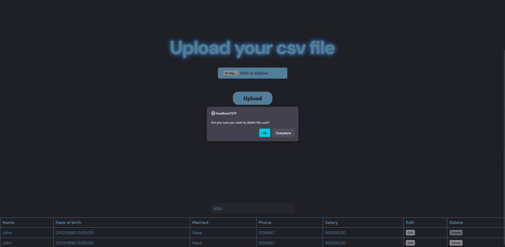
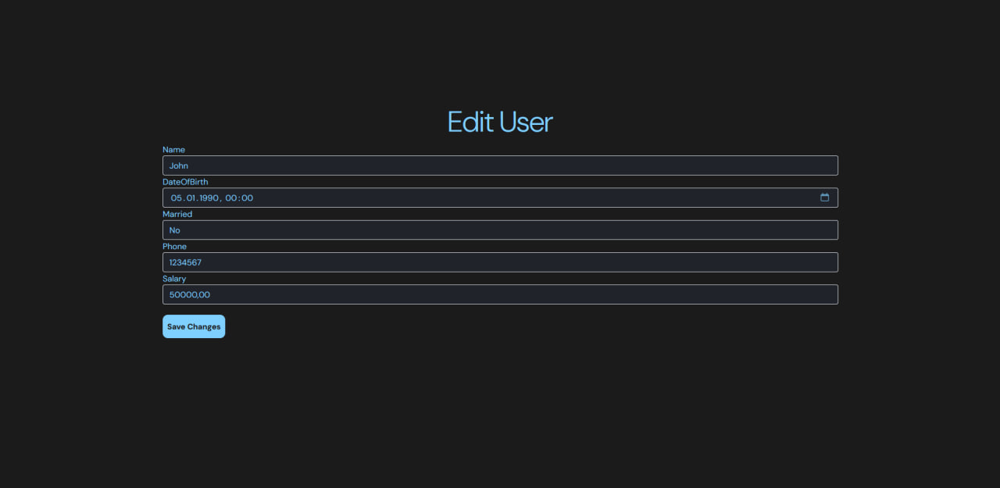

ASP.NET MVC web app for uploading csv files and storing them in the db, filtering, sorting, deleting and editing data. 

Nuget packages required for project:
Microsoft.EntityFrameworkCore \
Microsoft.EntityFrameworkCore.Design \
Microsoft.EntityFrameworkCore.SqlServer \
Microsoft.EntityFrameworkCore.Tools

To setup database: 1. Create db in mssql \
2. In settings json in connection string type down your server and db name \
3. In package manager console in vs: 
1) dotnet ef migrations add InitialCreate 
2) dotnet ef database update 

Screenshots:

